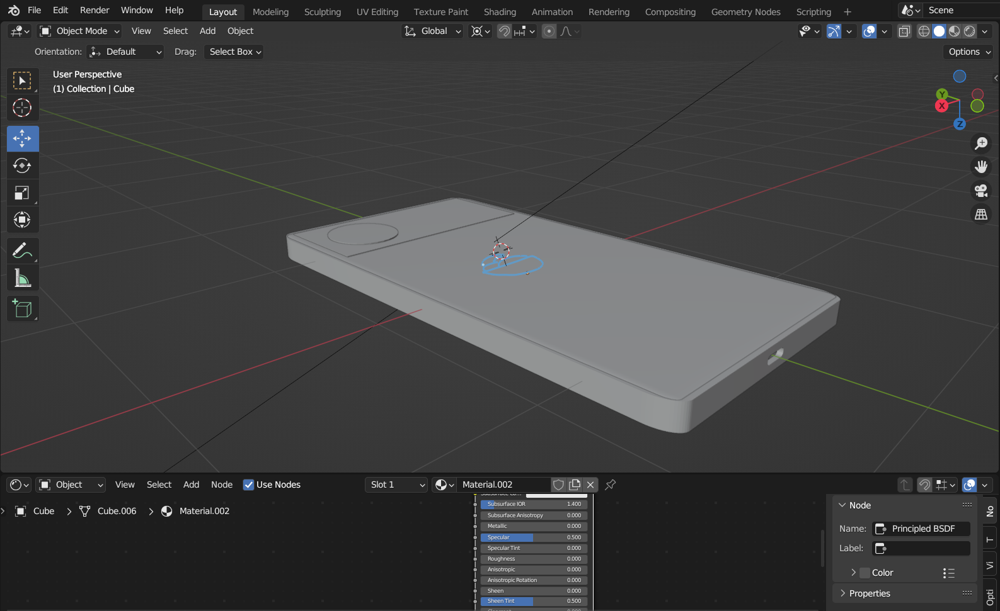
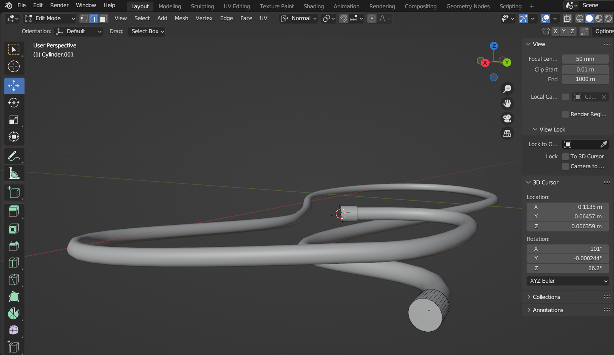
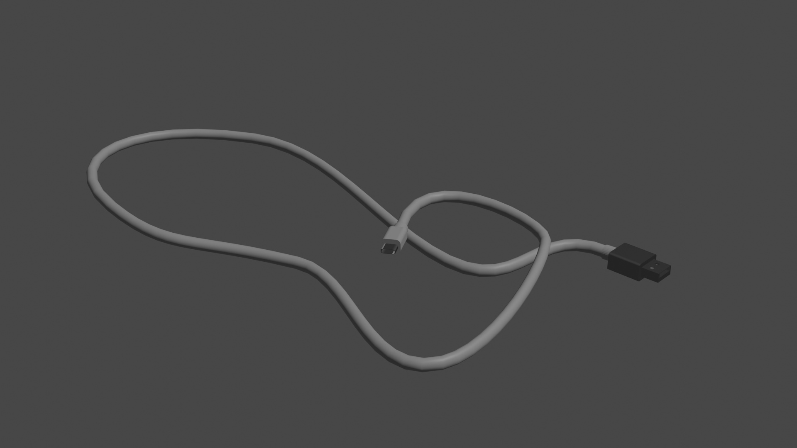

# blender
## Программа
- **Blender 3.4**
# Blender

 
<i>Логотип программного обеспечения Blender</i>

  

Blender 3D – бесплатный программный продукт, предназначенный для создания и редактирования трехмерной графики.

## Как использовать

Вы можете скачать файлы проекта и открыть их в Blender для просмотра и редактирования. Вы также можете использовать эту модель как основу для создания своих собственных зарядных устройств.

## Теория по созданию смартфона

 
<i>Пример работы в Blender</i>

  

1. Начните с создания формы смартфона, используя основные формы, такие как кубы, цилиндры и сферы. Нарисуйте контуры модели на изображении смартфона или используйте фотографию в качестве фона, чтобы получить форму корпуса смартфона. 

2. Создайте форму экрана смартфона, используя плоскость и настройки масштабирования (scale) и положения (position). 

3. Добавьте детали корпуса, такие как кнопки, разъемы, камеры и т.д. Используйте инструменты редактирования вершин, чтобы сделать их точными и детализированными. 

## Теория по созданию провода

 
<i>Пример работы в Blender</i>

  

1. Откройте программу Blender и выберите пустую сцену.
2. Создайте кривую, используя инструмент Curves в меню Add (Shift + A).
3. Измените форму кривой, используя инструменты из списка выбранных объектов в панели свойств (N).
4. Убедитесь, что вы выбрали режим Edit Mode, чтобы изменить точки кривой. (Также вы можете нажать на клавишу Tab, чтобы переключиться между режимами Object и Edit Mode).
5. Используйте инструменты для изменения кривой, например, перемещайте точки, добавляйте и удаляйте точки, чтобы настроить ее по своему усмотрению.
6. Создайте материал для кривой. Это можно сделать, выбрав созданный объект во вкладке Outliner, перейдя во вкладку Material и нажав кнопку New.
7. В панели свойств (N) наложите на кривую материал, щелкнув по имени материала.
8. Добавьте модификатор Bevel, чтобы сгладить грани кривой. (Модификатор Bevel может быть добавлен из меню Modifiers).

## Состав проекта

Проект включает в себя следующие файлы:
- `smatr.blend` - файл проекта Blender, содержащий модель смартфона.
- `charger.blend` - файл проекта Blender, содержащий модель зарядного устройства для смартфона.

 
<i>Моя модель в Blender</i>

  

## Автор

* VK: <a href="https://vk.com/ismail2003">Алиев Исмаил</a>
* Почта: aliev.ismail.2003@gmail.com
